<p align="center">
  
</p>

<p align="center">
  <strong>Self-updating directory of AI evaluation, training, and annotation platforms — DuckDB + dbt + Streamlit.</strong>
</p>

<p align="center">
  <a href="https://dacameragirl.github.io/ai-eval-job-radar/"></a>
  <a href="https://github.com/DaCameraGirl/ai-eval-job-radar"></a>
</p>

<p align="center">
  
  
</p>

### Languages

<p align="center">
  
  
</p>

### Stack

<p align="center">
  
  
  
</p>

<p align="center">
  Built by <strong>Angela Hudson</strong> · <a href="https://github.com/DaCameraGirl">DaCameraGirl</a>
</p>
# 🛰️ AI Eval Job Radar

[](https://github.com/DaCameraGirl/ai-eval-job-radar/actions/workflows/ci.yml)


**Live dashboard:** https://dacameragirl.github.io/ai-eval-job-radar/

I got tired of "best AI gig sites" lists that go stale the day they post and quote pay
rates somebody clearly made up. So I built the thing those lists should have been: a
small data app that tracks where you can actually get AI evaluation work, re-checks
itself every week, and refuses to invent a number it cannot see.

It is also, on purpose, a portfolio piece. It runs the exact stack these platforms hire
for: Python ingestion, a warehouse, dbt models, a dashboard. A tracker of AI eval jobs
that happens to prove I can do the data work those same jobs are about. Yes, that is a
little meta. That is the point.

<p align="center"></p>
<p align="center"></p>


- **Python** — ingestion, link and signup checks, the static-site generator, the Streamlit app
- **SQL (dbt)** — staging and mart models on dbt-duckdb
- **HTML + CSS** — the static GitHub Pages dashboard, in `templates/`
- **YAML** — the platform registry and the CI workflows

GitHub's language bar is tuned with `.gitattributes` so it shows all of the above, not
just Python.

<p align="center"></p>
<p align="center"></p>


| Step | Tool | Job |
|------|------|-----|
| Registry | `data/platforms.yml` | Hand-curated source of truth (name, tier, fit, pay notes) |
| Link health | Python + `requests` | Is each platform URL still alive? |
| Signup status | Python + `BeautifulSoup` | Best-effort read of open / waitlist / closed / unknown |
| Discovery | Tavily (optional) | Surface new platforms into `discovered_candidates.yml` for review |
| Warehouse | DuckDB | Disposable analytics store, rebuilt from the tracked files |
| Modeling | dbt (`dbt-duckdb`) | Staging plus marts |
| Dashboard | Streamlit | Filter by tier, category, and signup status |

```
data/platforms.yml ──▶ link + signup checks ──▶ data/status_snapshot.csv
                  └──▶ Tavily discovery ──────▶ data/discovered_candidates.yml
                                                        │
                                   load into DuckDB ◀───┘
                                          │
                                     dbt build (marts)
                                          │
                                   Streamlit dashboard
```

The registry is curated by hand and the pay notes are deliberately honest. The robot
only claims what it can verify: is the link alive, does the signup page read as open or
shut. Judgment stays with a person. If a platform hides its rates behind a login, the
radar says so instead of guessing.

<p align="center"></p>
<p align="center"></p>


Because this is about 50 rows, refreshed once a week. Snowflake would charge me credits
to watch a spreadsheet sleep. DuckDB gives the same SQL and the same dbt workflow for
free, runs in the process, and the models are written so they lift into Snowflake later
if the data ever earns it. Right tool, not the flashy one.

<p align="center"></p>
<p align="center"></p>


Every Monday a GitHub Action re-checks everything and opens a pull request with whatever
changed. It does not push to `main`. I read the diff and merge it if it is right. Even
the robot has to ask. On top of that, CI lints the code and rebuilds the whole pipeline
on every pull request, so nothing lands broken.

<p align="center"></p>
<p align="center"></p>


```powershell
py -3.11 -m venv .venv
.\.venv\Scripts\Activate.ps1
pip install -r requirements.txt

# Build the dashboard from the tracked data, no network calls:
python -m scripts.refresh --skip-network

# Or a full refresh (checks links and signup status; discovery needs a Tavily key):
python -m scripts.refresh

# See it:
streamlit run app/streamlit_app.py
```

<p align="center"></p>
<p align="center"></p>


Discovery is the only part that wants a key. Nothing else does.

```powershell
Copy-Item .env.example .env
# open .env and paste your Tavily key after TAVILY_API_KEY=
```

No key just means discovery skips itself. There is no Snowflake, OpenAI, Anthropic, or
quantum key anywhere in this project. Never commit `.env`.

<p align="center"></p>
<p align="center"></p>


Edit `data/platforms.yml`, open a pull request, let CI check it. To promote something the
robot found, move it out of `discovered_candidates.yml` into `platforms.yml` and write
real fit and pay notes for it.

<p align="center"></p>
<p align="center"></p>


Proprietary. Copyright (c) 2026 Angela Hudson. All Rights Reserved. This repo is public
so you can look, not so you can take. See [LICENSE](LICENSE).